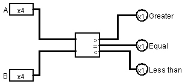
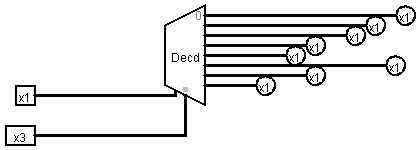

# logic-gates-logisim
Examples of Logic Gates using Logisim simulator

## XOR gate 
|X|Y|XOR|
|-|-|-|
|0|0|0|
|0|1|1|
|1|0|1|
|1|1|0|

[Beginner's tutorial (cburch.com)](http://cburch.com/logisim/docs/2.7/en/html/guide/tutorial/index.html)

[Logisim Beginner's Tutorial (youtube.com)](https://www.youtube.com/watch?v=cMz7wyY_PxE)

## AND, OR, NAND, NOR, XOR, XNOR and half and full Adder gates

[Logisim ALU Tutorial (youtube.com)](https://youtu.be/dYZ-Hwbcnq4)

## Half Adder

|IN A|IP B|OP S|OP C|
|-|-|-|-|
|0|0|0|0|
|0|1|1|0|
|1|0|1|0|
|1|1|0|1|

## Full Adder

IP Cin|IP A|IP B|OP S|OP C|
|-|-|-|-|-|
0|0|0|0|0|
0|0|1|1|0|
0|1|0|1|0|
0|1|1|0|1|
1|0|0|1|0|
1|0|1|0|1|
1|1|0|0|1|
1|1|1|1|1|

## Subtraction and Multiplication

## Subtraction

|IN A|IP B|OP S|OP C|
|-|-|-|-|
|0|0|0|0|
|0|1|1|1|
|1|0|1|0|
|1|1|0|0|

## Multiplication

|IN A|IP B|OP M|
|-|-|-|
|0|0|0|
|0|1|0|
|1|0|0|
|1|1|1|

## Comparator

The MSB (Most Significant Bit) is reserved for the sign.

|IN A|IP B|>|=|<|
|-|-|-|-|-|
|001|000|1|0|0|
|001|001|0|1|0|
|001|010|0|0|1|
|001|011|0|0|1|
|001|100|1|0|0|
|001|101|1|0|0|
|001|110|1|0|0|
|001|111|1|0|0|

## D-type Flip Flop

|D|CLK|Q|-Q|
|-|-|-|-|
|1|1|1|0|
|0|1|0|1|
|X|0|Last state||

## 8-bit Register (1 byte memory)

## Decoder

|I1|I2|O3|O2|O1|O0|
|-|-|-|-|-|-|
0|	0|	0|	0|	0|	1|
0|	1|	0|	0|	1|	0|
1|	0|	0|	1|	0|	0|
1|	1|	1|	0|	0|0|

## 2 out of 3 logic using gates
Any two inputs should be positive for the output to be positive.

|A|B|C|A+B|(A+B)*C|AB|(A+B)*C+AB|
|-|-|-|-|-|-|-|
|0|0|0|0|0|0|0|
|0|0|1|0|0|0|0|
|0|1|0|1|0|0|0|
|0|1|1|1|1|0|1|
|1|0|0|1|0|0|0|
|1|0|1|1|1|0|1|
|1|1|0|0|0|1|1|
|1|1|1|0|0|1|1|

## Tri-state buffer/inverter

### Buffer 

|C|I|O|
|-|-|-|
|0|0|Z|
|0|1|Z|
|1|0|0|
|1|1|1|

### Inverter

|C|I|O|
|-|-|-|
|0|0|Z|
|0|1|Z|
|1|0|1|
|1|1|0|

[Controlled Buffer/Inverter (cburch.com)](http://www.cburch.com/logisim/docs/2.3.0/libs/gates/controlled.html)

